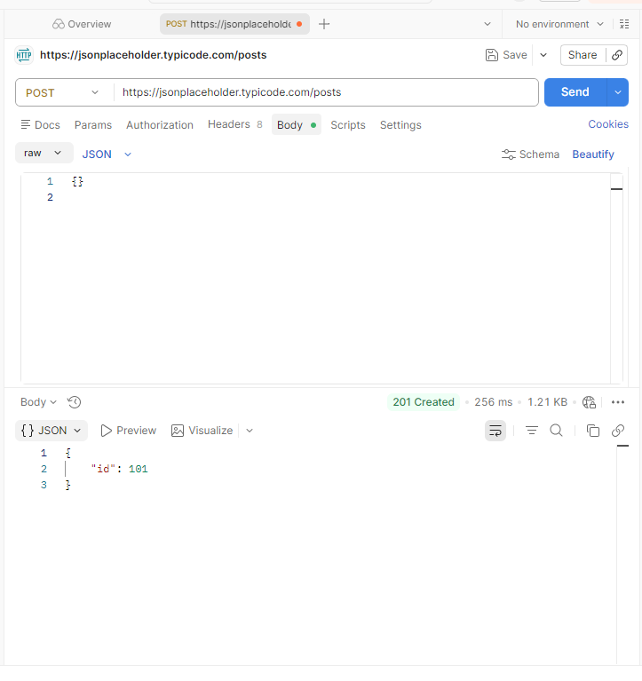
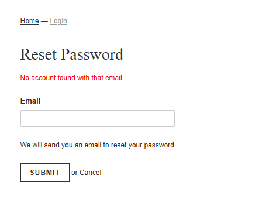

# QA Engineer Portfolio – Alex Rodriguez

## About Me

QA Engineer in training with hands-on experience in:

- API Testing (Postman)
- Web Testing (Manual)
- Functional, negative, and edge case testing
- Bug reporting and analysis

Focused on ensuring software quality through structured testing and clear documentation.

## Projects

### API Testing – JSONPlaceholder

- Tested REST API endpoints (GET, POST)
- Validated status codes and responses
- Identified lack of input validation in POST endpoint

Repository: https://github.com/AlxDRF616/api-testing-jsonplaceholder

###  Web Testing – SauceDemo Shopify

- Tested user flows: registration, login, password reset
- Identified UX issues and validation inconsistencies
- Detected potential security issue (user enumeration)

Repository: https://github.com/AlxDRF616/web-testing-saucedemo

## Highlights

### API Testing

### Web Testing

## Tools & Technologies

- Postman
- REST APIs
- Manual Testing
- Basic DevTools

## Key Skills Demonstrated

- Test case design
- Bug reporting
- Functional testing
- Negative testing
- Basic security awareness

## Contact

- LinkedIn: https://www.linkedin.com/in/alex-rodriguez-flores/
- Email: alx.rodflores@gmail.com